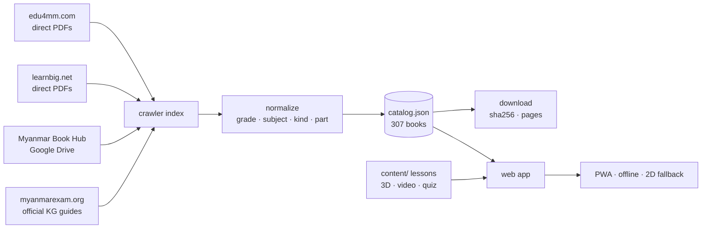

# BackBenchers Academy — မြန်မာ KG–12 အခမဲ့ 3D သင်ယူရေး

**Live site:** https://thiha-lynn.github.io/BackBenchersAcademy/ · **Repo:** https://github.com/Thiha-Lynn/BackBenchersAcademy · License: code MIT, lessons CC BY 4.0

> **Free, open, immersive learning for every child in Myanmar** — the national KG–Grade 12 curriculum as
> 3D interactive lessons and video explainers, built on top of the official textbooks.
>
> **မြန်မာနိုင်ငံရှိ ကလေးတိုင်းအတွက် အခမဲ့၊ ပွင့်လင်း၊ 3D immersive သင်ယူရေး** — သူငယ်တန်းမှ ၁၂ တန်းအထိ
> အမျိုးသားသင်ရိုးကို တရားဝင်ကျောင်းသုံးစာအုပ်များအပေါ် အခြေခံ၍ 3D သင်ခန်းစာများနှင့် ဗီဒီယိုရှင်းလင်းချက်များဖြင့် တည်ဆောက်သည်။

## What is in this repo

| Folder | What | Status |
|---|---|---|
| `crawler/` | Stdlib-only Python crawler that indexes every public source of Myanmar MoE textbooks, normalizes them into one catalog, and downloads them with a disk budget. | ✅ working |
| `catalog/` | **The catalog**: 463 files found across 4 live sources → **307 unique KG–12 curriculum books** (textbooks, teacher guides, answer guides, workbooks) with every alternate URL, size and classification. See [`catalog/COVERAGE.md`](catalog/COVERAGE.md). | ✅ generated |
| `data/` | Downloaded PDFs (git-ignored) + `manifest.json` with sha256/page counts for verification. | ⏳ downloading |
| `content/` | Lesson definitions: Burmese/English text, 3D scenes, videos, quizzes — one folder per lesson. | 🌱 3 example lessons |
| `web/` | The learning site: Vite + React + TypeScript + react-three-fiber, offline-first PWA, Unicode Burmese, 2D fallback for low-end phones. | 🌱 scaffold + 3D campus, bookshelf, PDF reader, lesson player, 3 procedural scenes |
| `docs/` | [Sources & provenance](docs/SOURCES.md) · [Roadmap](docs/ROADMAP.md) | ✅ |

## Quick start

```bash
# 1. catalog (no downloads, ~3 min, zero dependencies)
python3 -m crawler index        # crawl the public sources → catalog/raw/*.json
python3 -m crawler catalog      # → catalog/catalog.json, catalog.csv, COVERAGE.md

# 2. textbooks (choose your disk budget; resumable; verifies sha256)
python3 -m crawler download --budget-gb 2
python3 -m crawler download --grades 10,11,12 --kinds textbook

# 3. web app
cd web && npm install --legacy-peer-deps && npm run dev
```

## How it fits together



## Principles

1. **The national curriculum is the spine.** Grade → subject → chapter, so a student can use this next to school (or instead of it).
2. **Free forever, no accounts, works offline** on a cheap Android phone.
3. **Unicode Burmese only.**
4. **Textbooks stay MoE copyright**; we index and mirror them for education, we do not relicense them. See [CONTENT-LICENSE.md](CONTENT-LICENSE.md).
5. **Everything else is open**: code MIT, lessons CC BY 4.0.

## Contributing / ပါဝင်ကူညီရန်

Teachers, translators, 3D artists, video makers and developers are all needed — most tasks need no coding.
Read [CONTRIBUTING.md](CONTRIBUTING.md) (Burmese + English) and the [roadmap](docs/ROADMAP.md).

## Deploy (public)

* Push to `main` → [`.github/workflows/deploy.yml`](.github/workflows/deploy.yml) builds `web/` and publishes it to **GitHub Pages** (repo Settings → Pages → Source: *GitHub Actions*). The site is static, has no accounts, no analytics, no server.
* **In-app page rendering** goes through a tiny CORS proxy because the textbook hosts send no CORS headers: [`scripts/pdf-proxy-worker.js`](scripts/pdf-proxy-worker.js) on Cloudflare Workers (free tier), deployed at `https://bba-pdf-proxy.ack-enchers-cademy.workers.dev` and wired in via the repo variable `PDF_PROXY_URL`. Redeploy with `npx wrangler@4 deploy`. Without a proxy the reader falls back to "open original" links, which always work.
* Any static host works (Cloudflare Pages, Netlify, a school server): `cd web && npm ci --legacy-peer-deps && npm run build` → `web/dist/`.
